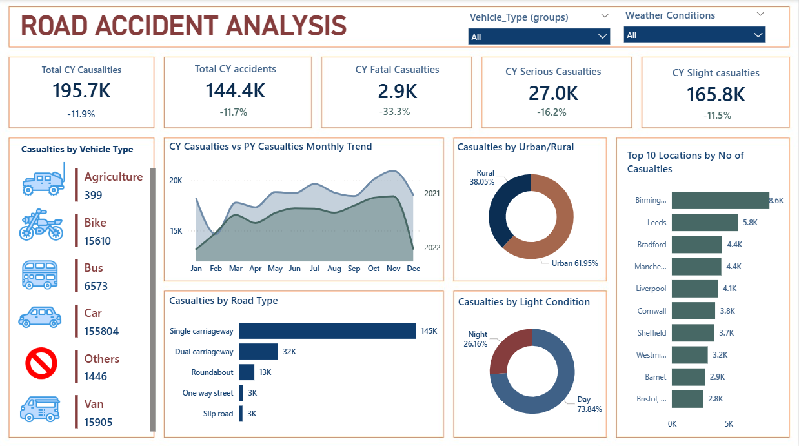

# 🚗 Road Accident Analysis (2021–2022)

**Data Analytics Project**

Python • SQL • Power BI • Excel • EDA • Data Visualization

<p align="left">       </p>

## 📑 Table of Contents
- [Project Overview](#project-overview)
- [Dataset Information](#dataset-information)
- [Business Problem](#business-problem)
- [Key Objectives](#key-objectives)
- [Top Insights](#top-insights)
- [Tech Stack](#tech-stack)
- [Dashboard Preview](#dashboard-preview)
- [KPI Validation](#kpi-validation)
- [Business Impact](#business-impact)
- [Methodology Summary](#methodology-summary)
- [Recommendations](#recommendations)
- [Future Enhancements](#future-enhancements)
- [Machine Learning Model](#machine-learning-model)
- [Project Structure](#project-structure)
- [How to Run This Project](#how-to-run-this-project)
- [About the Author](#about-the-author)


## ⭐ Project Overview


This project analyzes road accident data from 2021–2022 to uncover high-risk conditions, accident patterns, and contributing factors. The goal is to provide actionable insights for improving road safety and supporting data-driven decision-making by government authorities and transport planners.

Using Python, SQL, and Power BI, this end-to-end analysis delivers validated KPIs, visual dashboards, and clear business recommendations.

## 📁 Dataset Information

The dataset contains detailed road accident records from 2021–2022, including:
- Accident severity and casualties
- Vehicle type and number of vehicles involved
- Road type, speed limit, and surface conditions
- Weather, lighting conditions, and location attributes

Due to GitHub file size limitations, a representative sample is included in this repository.  
The full dataset was used for exploratory analysis, SQL validation, statistical testing, machine learning modeling, and Power BI dashboard development.


## 🎯 Business Problem

Road accidents result in significant loss of life and economic impact.  
Beyond understanding accident frequency, authorities need to identify **which conditions lead to more severe outcomes**.

Key questions addressed in this project:
- Under what conditions do accidents become more severe?
- Are night-time and rural accidents riskier than others?
- Which road, vehicle, and environmental factors contribute most to severity?
- How can data-driven insights support better safety planning and resource allocation?

This project addresses these questions using analytics, statistics, and machine learning.


## 📊 Key Objectives

- Analyze accident and casualty trends for 2021–2022.
- Identify high-risk conditions based on time, location, road, and environmental factors.
- Validate key performance indicators (KPIs) using SQL.
- Quantify accident severity using a custom severity score.
- Perform statistical testing to compare severity across different conditions.
- Build a machine learning model to predict accident severity.
- Present insights through an interactive Power BI dashboard.


## 🧠 Top Insights

- Two-wheelers account for the highest casualty share, indicating a major vulnerable road user group.
- Night-time accidents show statistically higher severity compared to daytime accidents.
- Urban areas report higher accident counts, while rural areas experience greater accident severity.
- Single carriageway roads contribute the highest overall severity risk.
- Clear seasonal patterns are observed, with peaks during specific months.


## 📈 Advanced Analytics

This project was extended beyond descriptive analysis to include diagnostic and advanced analytical techniques:

- **Severity Score Engineering** to quantify accident impact
- **Statistical Hypothesis Testing (Mann–Whitney U Test)** to validate:
  - Day vs Night accident severity
  - Urban vs Rural accident severity
- **Trend Analysis** using moving averages and seasonality
- **District-level risk profiling** to identify high-risk regions

  ### 🔻 Severity Funnel Analysis

A funnel-based approach was used to understand how accidents escalate across severity levels.

#### Key Findings:
- ~85% of accidents are slight in severity  
- ~13% escalate to serious conditions  
- ~1.3% result in fatal outcomes  

#### Funnel Insight:
- Approximately 13% of total accidents become serious  
- Nearly 9% of serious accidents further escalate into fatalities  

#### Business Interpretation:
Although fatal accidents are relatively rare overall, the conversion from serious to fatal is significant. This highlights the need to focus on preventing escalation through improved road safety measures, faster emergency response, and targeted interventions in high-risk scenarios.

- **District-level risk profiling** to identify high-risk regions

This approach helps shift focus from accident frequency to severity escalation risk.


## 🛠️ Tech Stack

### Languages & Tools

- Python (Pandas, NumPy, Matplotlib)
- SQL Server
- Power BI
- Excel
- Google Colab

### Core Skills Demonstrated
- Data Cleaning & Preprocessing  
- Exploratory Data Analysis (EDA)  
- SQL-Based KPI Validation  
- KPI & Metric Design  
- Dashboard Development  
- Insight Generation & Storytelling  

## 🔄 Project Workflow

Data Collection → Cleaning → EDA → Visualization → Insights → Dashboard → Recommendations

## 📊 Dashboard Preview




## 🧪 KPI Validation

All KPIs displayed in Power BI — including total accidents, total casualties, severity splits, monthly trends, and percentages — were independently validated using SQL queries.

This ensures that the dashboard metrics are:
- Accurate
- Consistent
- Reliable for decision-making

## 🛣️ Methodology Summary

Data Cleaning — handled missing values, fixed date/time formats, standardized categories

EDA (Python) — distributions, correlations, severity analysis, monthly trends

SQL Validation — re-computed KPIs for accuracy

Dashboarding (Power BI) — built interactive visuals for deeper insight

Recommendations — actionable insights for safety improvement

## 📌 Recommendations

Strengthen enforcement and safety programs for two-wheeler riders

Install better lighting and reflective road markings in night-high-risk areas

Improve emergency medical access in rural regions

Upgrade single carriageway roads to safer designs

Implement seasonal awareness campaigns during peak accident months

## 🔮 Future Enhancements

Predict accident hotspots using machine learning

Add geospatial heatmaps (GIS mapping)

Build real-time streaming dashboard

Develop severity prediction models

## 🤖 Machine Learning Model (Accident Severity Prediction)

A machine learning model was developed to predict accident severity (Fatal / Serious / Slight).

### 🔧 Model Details
- **Algorithm:** RandomForestClassifier  
- **Preprocessing:**  
  - OneHotEncoding (categorical features)  
  - StandardScaler (numerical features)  
  - Missing value imputation  
- **Imbalance Handling:** `class_weight="balanced"`  
- **Train/Test Split:** 80/20  

### 📈 Model Performance
- **Accuracy:** 84.08%

-Full classification report available at → `visuals/classification_report.txt`
- **Accuracy:** Model accuracy varies due to class imbalance  
- Evaluation focused on **recall and F1-score** for Serious and Fatal accidents


### 🔝 Top Predictive Features

Feature importance analysis helps explain *why* accidents become severe.  
Higher values indicate factors that contribute more strongly to accident severity, enabling policymakers to prioritize infrastructure, enforcement, and safety interventions.

| Feature | Importance |
|--------|------------|
| Local_Authority_(District) | 0.4897 |
| Day_of_Week | 0.1064 |
| Vehicle_Type | 0.0643 |
| Number_of_Vehicles | 0.0501 |
| Number_of_Casualties | 0.0435 |
| Speed_limit | 0.0401 |
| Junction_Detail | 0.0380 |
| Road_Surface_Conditions | 0.0322 |
| Weather_Conditions | 0.0308 |
| Light_Conditions | 0.0299 |


### 📦 Model Artifacts (Saved)
- `models/severity_model.pkl`
- `visuals/confusion_matrix.png`
- `visuals/feature_importances.png`
- `visuals/sample_predictions.csv`


## 📁 Project Structure
```

├── 📄 Road_Accident_Analysis_Report.pdf
├── 📊 PowerBI_Dashboard.pbix
├── 📁 SQL_Validation_Queries.sql
├── 📓 Jupyter_Notebook_EDA.ipynb
├── 📁 models/
├── 📁 visuals/
└── README.md
```

---


## 🧩 How to Run This Project
```bash
 1️⃣ Clone the repository

git clone https://github.com/Likithasriram/Road_Accident_Analysis.git
cd Road_Accident_Analysis

2️⃣ Install dependencies

pip install -r requirements.txt

3️⃣ Open the notebook

jupyter notebook

4️⃣ Open the Power BI dashboard

/dashboard/Road_Accident_Analysis.pbix
```


## 👩‍💼 About the Author

P. Likhitha

Data Analyst | SQL | Python | Power BI

Passionate about turning raw data into actionable insights through analytics, visualization, and machine learning.


